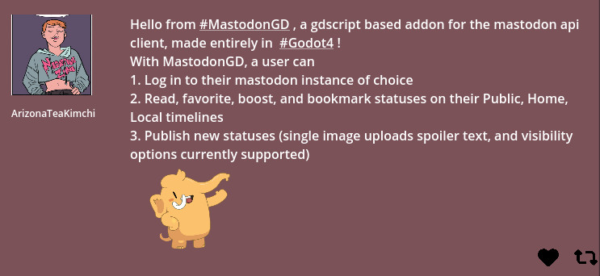

A Mastodon Client addon for the [Godot Game Engine](https://godotengine.org/).

_**NOTE:** This is addon is for Godot 4 only, and is still deeply a work in progress._

## Installation

1. Clone or download a copy of this repository.
2. Copy the contents of `addons/Mastodon_GD` into your `res://addons/Mastodon_GD` directory.

## Example
Initializing a verified mastodon client requires only a few lines of code.

``` GDScript

var mastodon_client: MastodonClient

func _ready():
    var instance_name: String = 'mastodon.gamedev.place'
    var application_name: String = 'MastodonGD Test App'

    # This value will be used to encrypt and decrypt client-side application and token data
    # leave blank if you don't want app and token data to be stored
    # (This will require the user to log back in to their account every time they open your app).
    var client_side_encryption_key: String = 'Secret decryption/encyption key' 

    self.mastodon_client: MastodonClient = MastodonClient.new()
	self.add_child(self.mastodon_client)
	await self.mastodon_client.Init_Client(instance_name, application_name, client_side_encryption_key)
```

The `MastodonClient` class currently supports nearly all Mastodon api endpoint operations such as
- Get the user's public, home, and local timelines
- Get statuses of a specific account
- Read, favourite, boost, and bookmark statuses
- Post or schedule a new status/reply with
   - Multi-media attachments
   - Adding status spoilers and spoiler text
   - Custom visiblity (public, direct, etc)

and more! All non-admin methods described in the [Mastodon API Documentation](https://docs.joinmastodon.org/methods/) should be available from the `MastodonClient` class.

If one is missing, or isn't working as expected, please report an issue, or submit a pull request!

``` GDScript

# Getting an authenticated user's timeline
func get_home_timeline() -> MastodonTimeline:
    return await self.mastodon_client.get_home_timeline()

# Get a list of the most recent statuses for a specific user (including boosts)
func get_account_statuses(account_id: String) -> MastodonAccount:
    return await self.mastodon_client.get_account_statuses(account_id)

```

## Contributors

MastodonGD is made by [AZTeaKimchi](https://mastodon.gamedev.place/@AZTeaKimchi), if you would like to contribute or make a feature request feel free!

## License

Licensed under the MIT license, see `LICENSE.txt` for more information.
